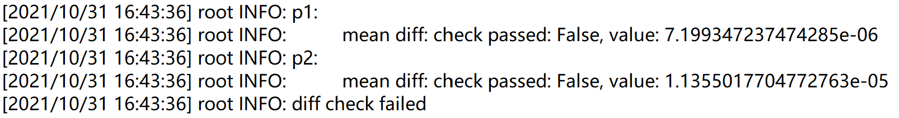
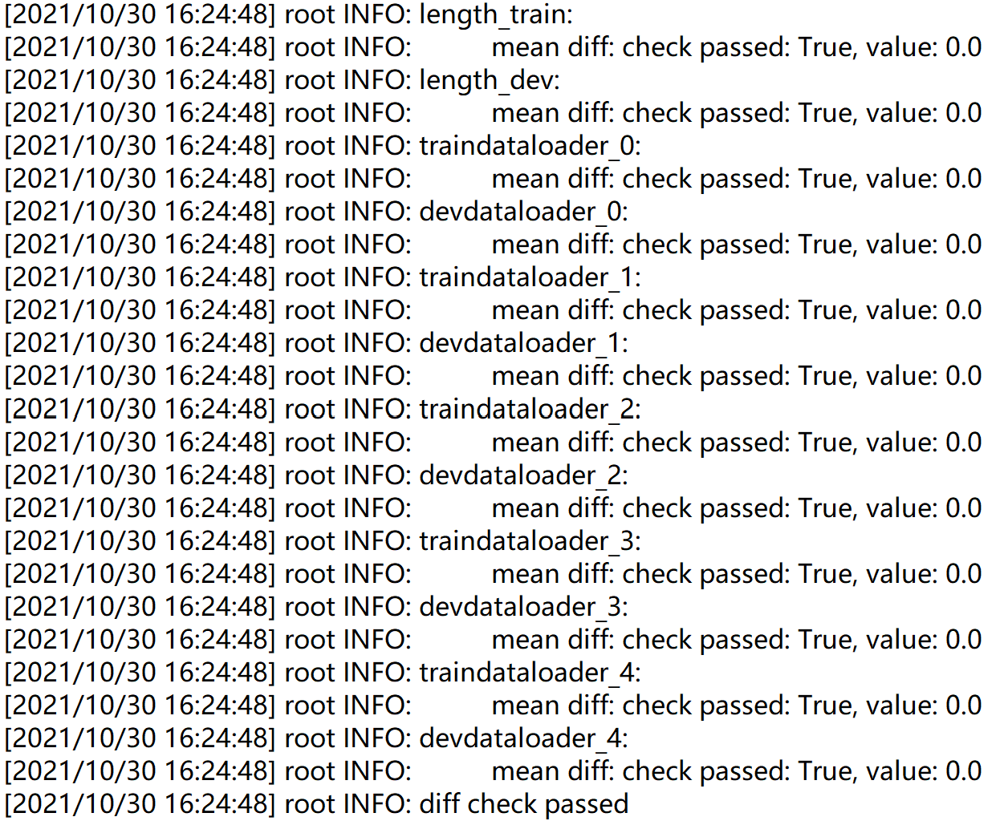
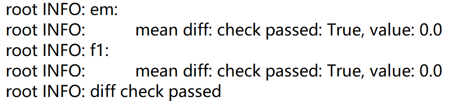
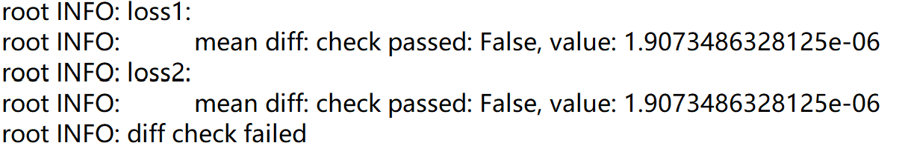
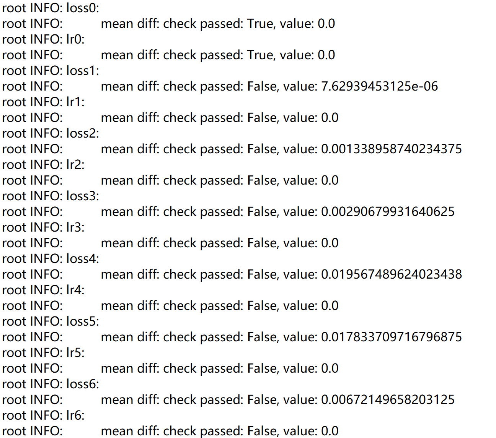
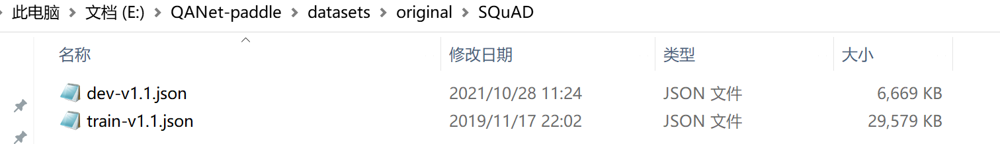

## QANET_paddle

English | [简体中文](./README_CN.md) 

 * [QANET_paddle](#QANET_paddle)
     * [1、Introduction](#1-Introduction)
     * [2、Accuracy+Align](#2-Accuracy+Align)
     	* [step1: Model Structure Align](#step1-Model-Structure-Align)
        * [step2: Dataloader Align](#step2-Dataloader-Align)
        * [step3: Metric Align](#step3-Metric-Align)
        * [step4: Loss Function Align](#step4-Loss-Function-Align)
        * [step5: Backword Align](#step5-Backword-Align)
     * [3、Datasets](#3-Datasets)
     * [4、Environment](#4-Environment)
     * [5、Quick start](#5-Quick start)
        * [step1: Clone](#step1-Clone )
        * [step2: Data Prep ](#step2-Data-Prep)
        * [step3: Train](#step3-Train)
     * [6、Code Structure](#6-Code-Structure)
        * [6.1 Structure](#6.1-Structure)
        * [6.2 Parameter Description](#6.2-Parameter-Description)
        * [6.3 Training Process](#6.3-Training-Process)
     * [7、Model Information](#7-Model-Information)


## 一、Introduction

This project is based on the paddlepaddle_v2.2.0rc0 framework to reproduce QANET(ICLR 2018)[链接 ](https://arxiv.org/abs/1804.09541)。

The current end-to-end machine reading and question answering models are mainly based on recurrent neural networks that include attention. Apart from the advantages, the main disadvantage of these models is that they are less efficient in training and inference. Therefore, the author proposed a question and answer architecture called QANet. This network does not need to use a recursive network. Its encoder is completely composed of convolution and self-attention. The convolutional network processes local information, and self-attention processes the global scope. information.

**paper:**

- [1] Yu, A. W. ,  D  Dohan,  Luong, M. T. ,  Zhao, R. ,  Chen, K. , &  Norouzi, M. , et al. (2018). Qanet: combining local convolution with global self-attention for reading comprehension.

**Reference project：**

- [BangLiu/QANet-PyTorch: Re-implement "QANet: Combining Local Convolution with Global Self-Attention for Reading Comprehension" (github.com)](https://github.com/BangLiu/QANet-PyTorch)

**Project AI Studio address：**

- notebook：

## 二、Accuracy+Align

The model is trained + verified on the SQuAD1.1 dataset.

! ! !  Indicators and Results

Please refer to the specific steps of align: https://github.com/PaddlePaddle/models/blob/develop/docs/ThesisReproduction_CV.md

### step1: Model Structure Align 

When aligning the model structure, there are generally 3 main steps:

- Network structure code conversion
- Weight conversion
- Model network correctness verification

Align result is as follows：



### step2: Dataloader Align

Align result is as follows：



### step3: Metric Align

Align result is as follows：



### step4: Loss Function Align

### 

### step5: Backword Align




## 三、Dataset

[SQuAD1.1](https://datarepository.wolframcloud.com/resources/SQuAD-v1.1)

- dataset size：
  - train：87.5K
  - dev：10.1K
- data format：TEXT，JSON

## 四、Environment

- Hardware：CPU、GPU（16G and above）
- Framework：
  - PaddlePaddle >= 2.2.0rc0
- package：
  - spacy
  - ujson
## 5、Quick Start

### step1: Load Data

```bash
# clone this repo
git clone git@github.com:27182812/QANet_paddle.git
cd QANet_paddle
```
****Installation dependency****

```bash
pip install -r requestments.txt
```

### step2: Data Prep

1. Create the "datasets/original" folder in the top-level directory, put [glove.840B.300d.txt](https://www.kaggle.com/takuok/glove840b300dtxt) into the "Glove" folder under the secondary file, and place the SQuAD dataset into the "SQuAD" folder. As shown below:

   

   

   

   

2. First run, add `--processed_data` to preprocess the data, and put the processed data under the "datasets/original/processed" folder. It can be loaded directly in the next run.

### step3: Training

1. Put pre-training weights in the top-level directory（I Initialized pytorch weight and  converted to pdparams format)，here：https://aistudio.baidu.com/aistudio/datasetdetail/114636 。
2. run `QANet_main.py`

```bash
python QANet_main.py --batch_size 32 --epochs 60 --with_cuda --use_ema
```

## 6、Code Structure

### 6.1 Main Structure

```
├─data_loader                     # data load
├─datasets                        # dataset
├─imgs                            # illustrative picture
├─log_reprod                      # align files
├─model                           # model
├─trainer                         # train
├─util                            # utility function
│  README.md                      # English readme
│  README_CN.md                   # Chinese readme
│  requirements.txt               # rely
│  QANet_main.py                  # run file
```
### 6.2 Parameter Description

Parameters related to training and evaluation can be set in `QANet_main.py`, as follows:

| 参数         | 默认值            | 说明                                   | 其他        |
| ------------ | ----------------- | -------------------------------------- | ----------- |
| --batch_size | 32,      Optional | Training batches                       |             |
| --epochs     | 30，   Optional   | Training epochs                        |             |
| --with_cuda  | False, Optional   | Whether use GPu                        | 无GPU可不加 |
| --use_ema    | False, Optional   | Whether use exponential moving average |             |
| --lr         | 0.001,Optional    | Learning rate                          |             |

### 6.3 Training Process

See 5、Quick Start

## 7、Model information

For other information about the model, please refer to the following table:

| information     | description                                          |
| -------- | -----------------------------------------------------------|
| Author   | AshlingQian                                                  |
| Date     | 2021.10                                                      |
| Framework version | Paddle 2.2.0rc0                                    |
| Application scenarios | NLP、MRC                                      |
| Support hardware | GPU、CPU                                                     |
| Download link | [trained model](https://aistudio.baidu.com/aistudio/projectdetail/2542813)                                             |
| Online operation | [notebook](https://aistudio.baidu.com/aistudio/projectdetail/2542813) |

